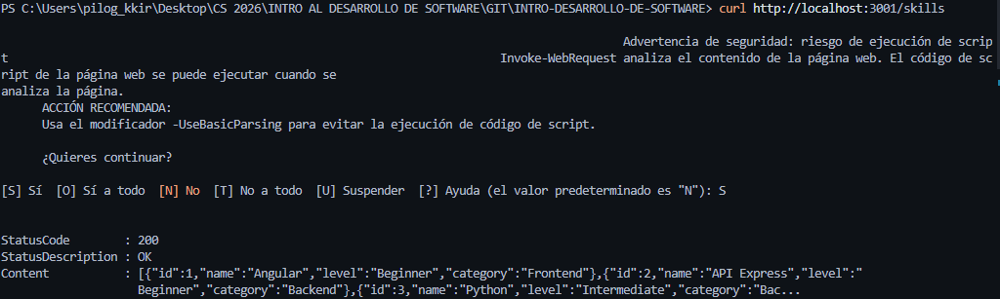
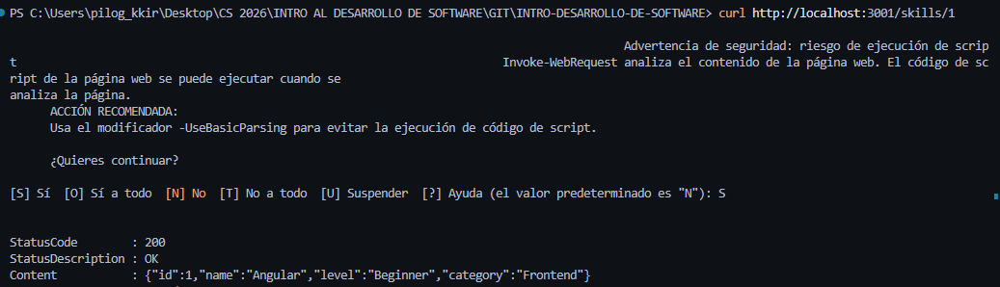
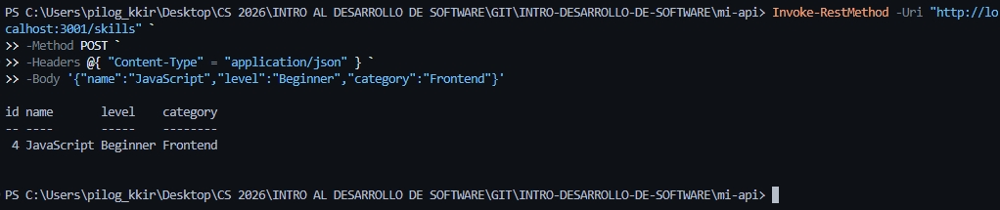
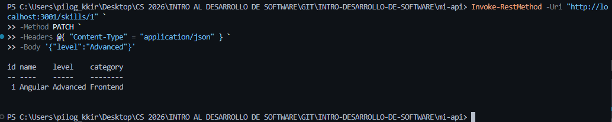
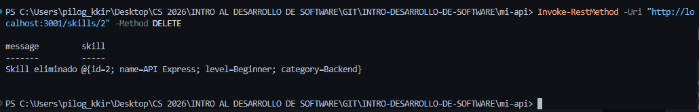

# SCREENSHOTS

## GET

### 1. Ver todas las skills
curl http://localhost:3001/skills

---

### 2. Ver una skill específica
curl http://localhost:3001/skills/1

---

## POST

### 3. Crear una nueva skill
curl -X POST http://localhost:3001/skills \
-H "Content-Type: application/json" \
-d '{
  "name": "JavaScript",
  "level": "Beginner",
  "category": "Frontend"
}'

---

## PATCH

### 4. Actualizar una skill

> Nota: Este request fue ejecutado con PowerShell (`Invoke-RestMethod`) debido a incompatibilidades con curl.

Ejemplo equivalente:

curl -X PATCH http://localhost:3001/skills/1 \
-H "Content-Type: application/json" \
-d '{"level": "Advanced"}'

---

## DELETE

### 5. Eliminar una skill

> Nota: Este request fue ejecutado con PowerShell (`Invoke-RestMethod`).

Ejemplo equivalente:

curl -X DELETE http://localhost:3001/skills/2

---

## Importante

Las peticiones PATCH y DELETE fueron realizadas utilizando `Invoke-RestMethod` en PowerShell, ya que el comando `curl` en Windows es un alias de `Invoke-WebRequest` y no soporta parámetros como `-X`, `-H` o `-d`.

Todas las rutas también fueron probadas en Postman para validar su funcionamiento y generar las evidencias.